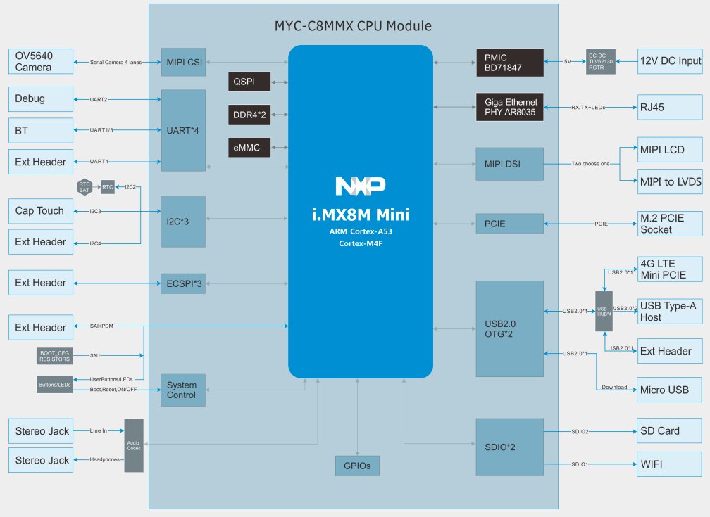
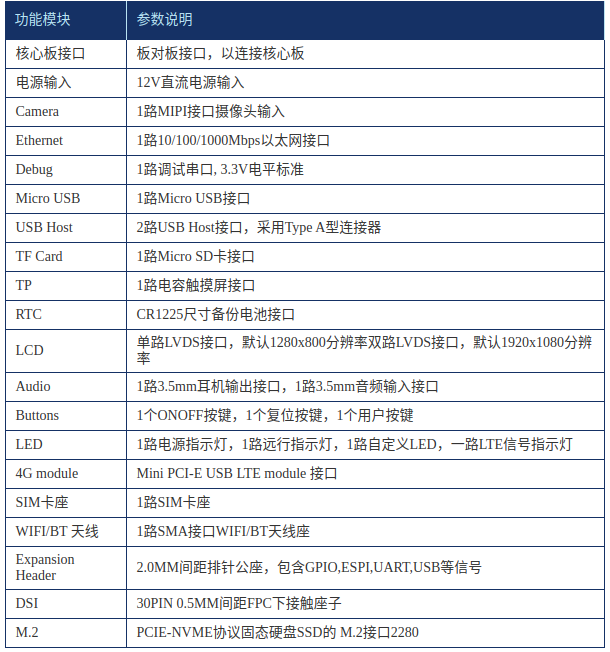

# device_board_osware

## 简介
#### 开发板简介

- [MILOS_Standard0]

基于 NXP i.MX8M Mini处理器，1.8G Hz主频。接⼝外设丰富：LVDS显⽰、MIPI-DSI信号引出、 MIPI-CSI摄像头接⼝、⽀持⾳频输⼊输出、千兆⽹、多路USB、多串⼝、等多种通信 接⼝；提供OpenHarmony系统。⼴泛应⽤于⾼性能仪器仪表（⼯业及医疗）、⼯业控制及⼈机互动装置、智能交通、智慧消防、智慧楼宇等领域。

#### 开发板架构图
****

#### 开发板架构说明
****

## 目录

```
device/board/osware
├── MILOS_Standard0                       # MILOS_Standard0开发板
└── ...
```

## 使用说明

MILOS_Standard0参考:
- [MILOS_Standard0](https://gitee.com/openharmony-sig/device_board_osware/blob/master/imx8mm/README_zh.md)

## 相关仓

* [vendor/osware](https://gitee.com/openharmony-sig/vendor_osware)
* [device/soc/nxp](https://gitee.com/openharmony-sig/device_soc_nxp)