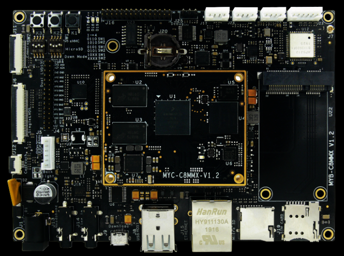
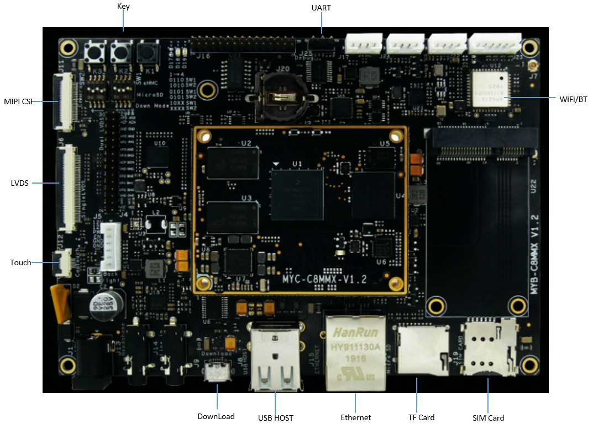
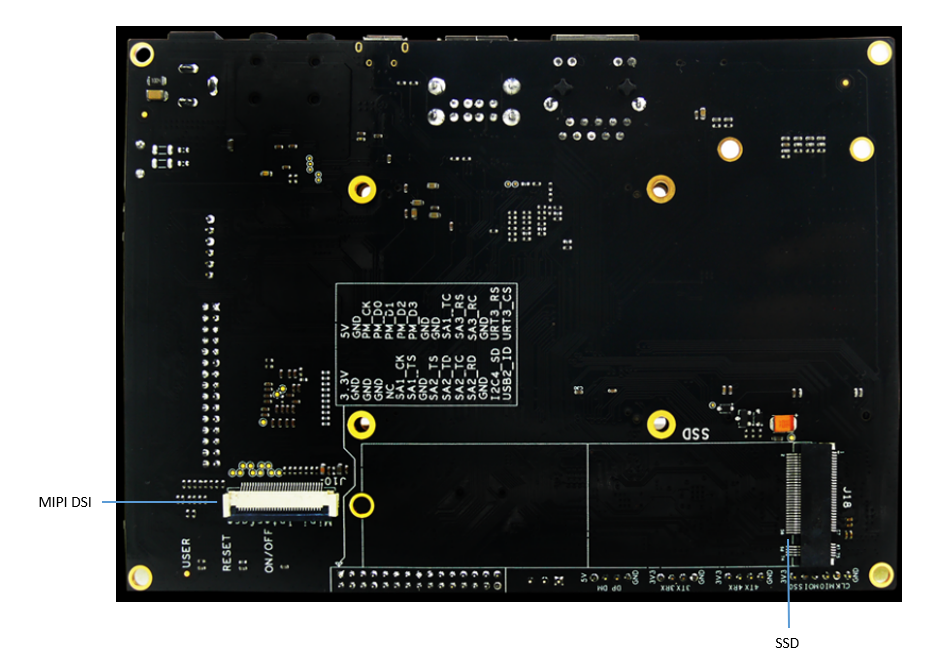
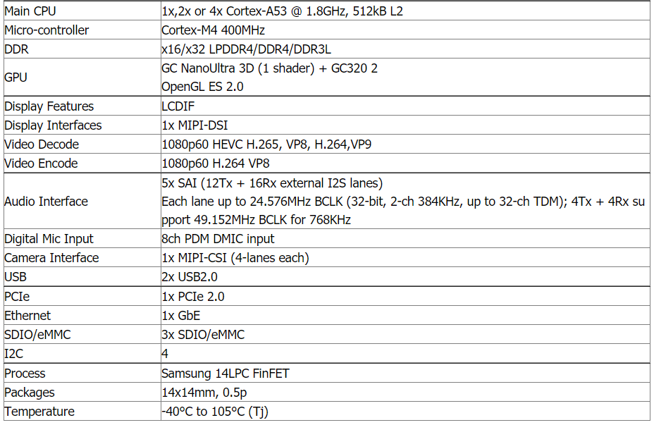
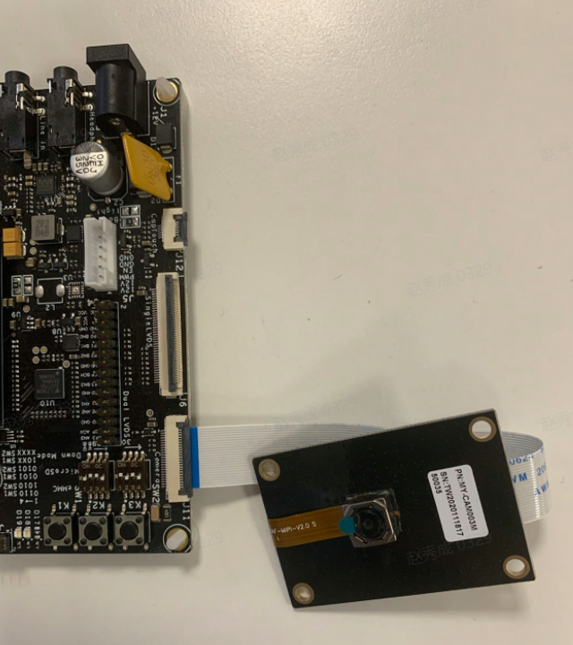
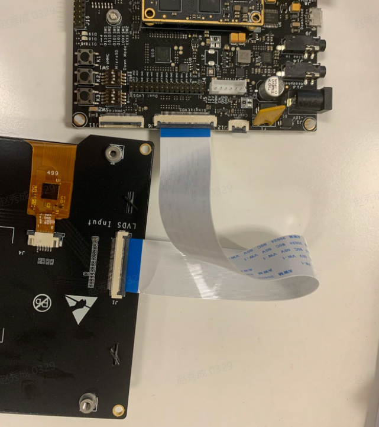

# 【开发板名称】OSware MILOS_Standard0开发套件

**简介**

基于 NXP i.MX8M Mini处理器，1.8G Hz主频。接⼝外设丰富：LVDS显⽰、MIPI-DSI信号引出、 MIPI-CSI摄像头接⼝、⽀持⾳频输⼊输出、千兆⽹、多路USB、多串⼝、WIFI及蓝⽛模块等多种通信 接⼝；提供OpenHarmony，Ubuntu Linux，Android等多种系统。⼴泛应⽤于⾼性能仪器仪表（⼯ 业及医疗）、⼯业控制及⼈机互动装置、智能交通、智慧消防、智慧楼宇等领域

OSware MILOS_Standard0开发板外观图如图1所示：

****

图1：OSware MILOS_Standard0开发板外观图

**一、开发板详情**

**1、OSware MILOS_Standard0开发板正面外观图**

****

图2：OSware MILOS_Standard0开发板正面外观图

2、**OSware MILOS_Standard0开发板反面外观图**

****

图3：OSware MILOS_Standard0开发板反面外观图

**二、开发板规格**

NXP iMX 8m mini采用四核64位Cortex-A53
处理器，主频高达1.8GHz；具有低功耗高性能的特点，可广泛应用于嵌入式人工智能领域。

**1、OSware MILOS_Standard0开发板规格图**

****

图4：OSware MILOS_Standard0开发板规格图

**三、开发板功能**

**·** 工作温度：-40℃～105℃

**·** 高性价比：适合中小规模企业/用户使用

· 集成ROHM电源芯片及200PIN工业连接器

· 核心板采用6层布线工艺，尺寸仅49mm×60mm，可满足小型终端产品空间需求

· 支持多系统：支持OpenHarmony、Yocto Linux、Linux Ubuntu、Android等系统

**四、开发板配件安装：**

**1、摄像头模组安装如下图：**

**2、LVDS 屏幕安装如下图：**

**五、开发板应用场景**

OSware MILOS_Standard0开发板适用于智能NVR、云终端、物联网网关、工业控制、信息发布终端、多媒体广告机等场景，亦可广泛应用于嵌入式人工智能领域。

**六、搭建开发环境**

**1、安装依赖工具**

安装命令如下：

sudo apt-get update && sudo apt-get install binutils git git-lfs gnupg flex
bison gperf build-essential zip curl zlib1g-dev gcc-multilib g++-multilib
libc6-dev-i386 lib32ncurses5-dev x11proto-core-dev libx11-dev lib32z1-dev ccache
libgl1-mesa-dev libxml2-utils xsltproc unzip m4 bc gnutls-bin python3.8
python3-pip ruby

**说明：** 
以上安装命令适用于Ubuntu18.04，其他版本请根据安装包名称采用对应的安装命令。

**2、获取标准系统源码**

**前提条件**

1）注册码云gitee账号。

2）注册码云SSH公钥，请参考[码云帮助中心](https://gitee.com/help/articles/4191)。

3）安装[git客户端](http://git-scm.com/book/zh/v2/%E8%B5%B7%E6%AD%A5-%E5%AE%89%E8%A3%85-Git)和[git-lfs](https://gitee.com/vcs-all-in-one/git-lfs?_from=gitee_search#downloading)并配置用户信息。

git config --global user.name "yourname"

git config --global user.email "your-email-address"

git config --global credential.helper store

4）安装码云repo工具，可以执行如下命令。

curl -s https://gitee.com/oschina/repo/raw/fork_flow/repo-py3 \>
/usr/local/bin/repo \#如果没有权限，可下载至其他目录，并将其配置到环境变量中

chmod a+x /usr/local/bin/repo

pip3 install -i https://repo.huaweicloud.com/repository/pypi/simple requests

**获取源码操作步骤**

1） 通过repo + ssh 下载（需注册公钥，请参考码云帮助中心）。

repo init -u git@gitee.com:openharmony/manifest.git -b master --no-repo-verify

repo sync -c

repo forall -c 'git lfs pull'

2） 通过repo + https 下载。

repo init -u https://gitee.com/openharmony/manifest.git -b master
\--no-repo-verify

repo sync -c

repo forall -c 'git lfs pull'

**执行prebuilts**

在源码根目录下执行脚本，安装编译器及二进制工具。

bash build/prebuilts_download.sh

下载的prebuilts二进制默认存放在与OpenHarmony同目录下的OpenHarmony_2.0_canary_prebuilts下。

**七、编译调试**

**1、编译**

在Linux环境进行如下操作:

1） 进入源码根目录，执行如下命令进行版本编译。

./build.sh --product-name imx8mm –ccache

2） 检查编译结果。编译完成后，log中显示如下：

post_process

=====build imx8mm successful.

2022-06-1 09:22:28

编译所生成的文件都归档在out/imx8mm/ohos-arm-release/目录下，结果镜像输出在
out/imx8mm/ohos-arm-release/packages/phone/images/ 目录下。

3） 编译源码完成，请进行镜像烧录。

**2、烧录工具**

烧写工具下载及使用。
[参考](https://gitee.com/osware_admin_admin/burning-tools-and-guidelines)

